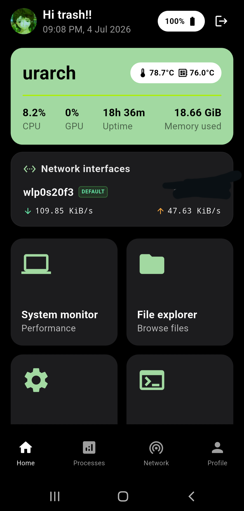
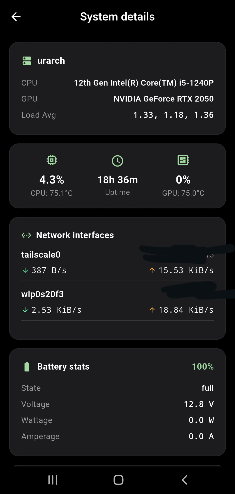
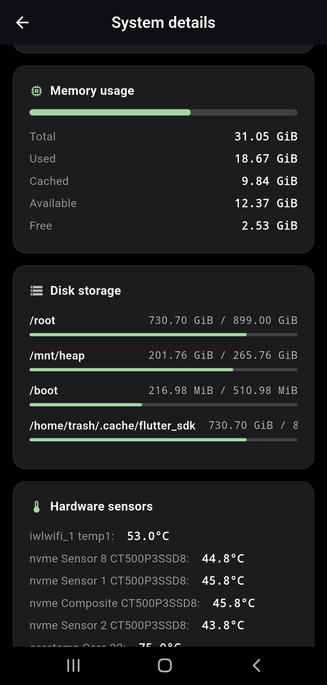
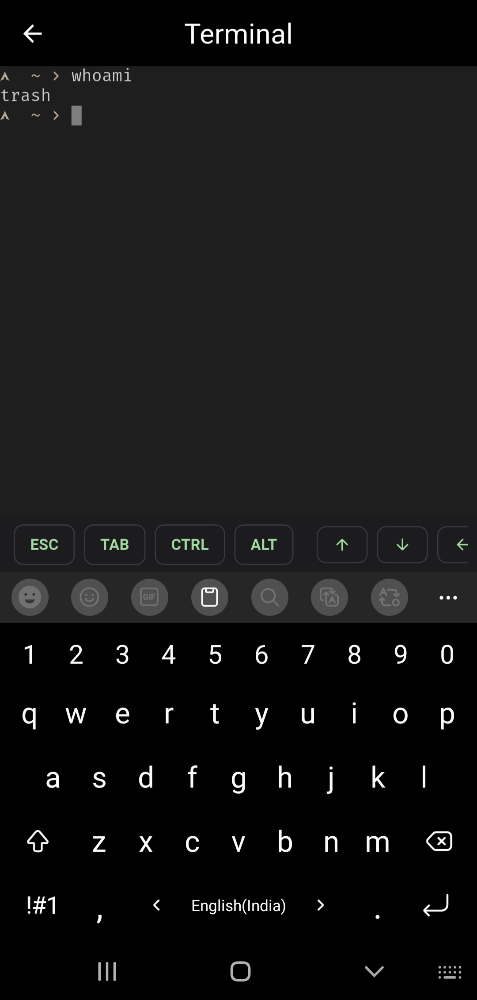
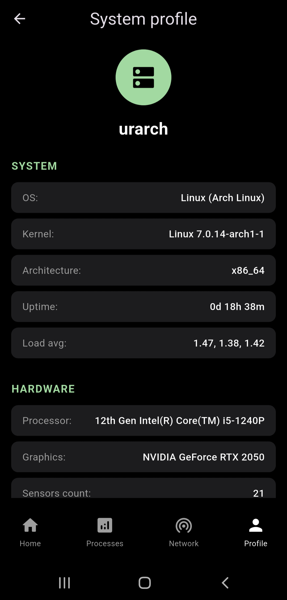
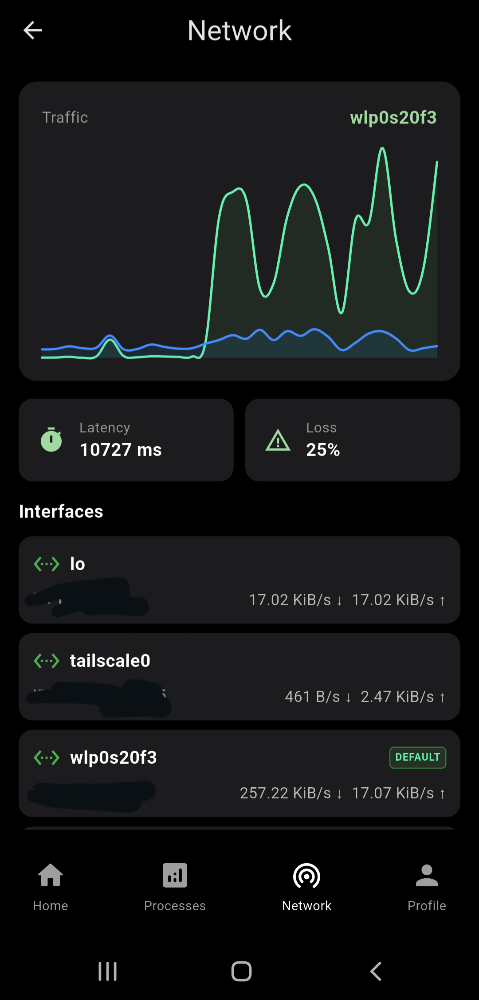
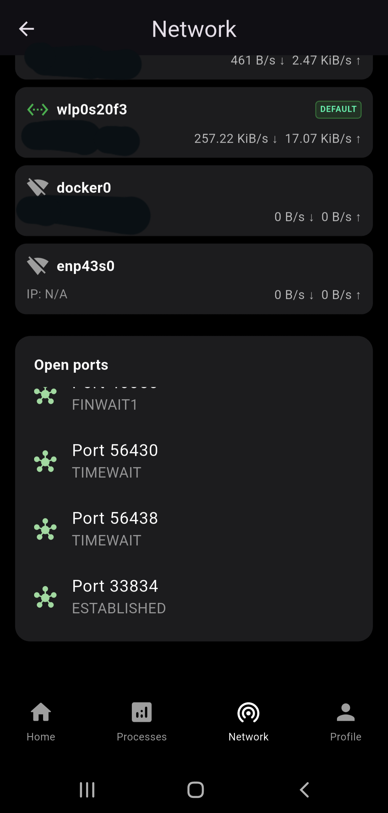
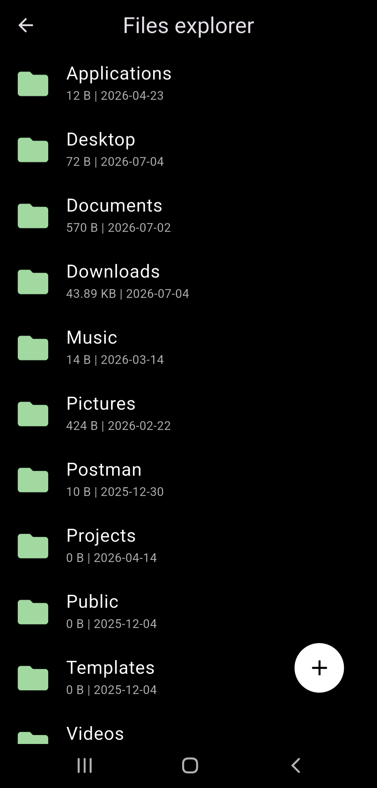
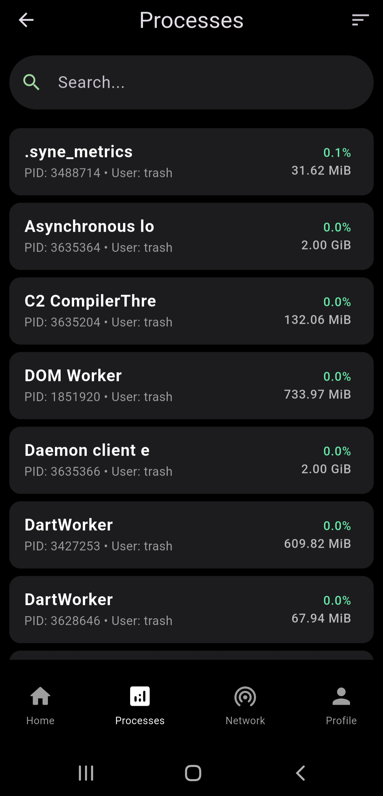

<div align="center">


<h1>Syne</h1>

<br />

<h3><b>Monitor and control your server remotely via phone</b></h3>

A lightweight app that allows server administration with a clean and simple mobile interface.

<a href="#features">Features</a> •
<a href="#installation">Installation</a> •
<a href="#usage">Usage</a> •
<a href="#screenshots">Screenshots</a> •
<a href="#contributing">Contributing</a>

</div>

---

## Overview

Syne is a lightweight, modern application designed to simplify server management over SSH. It provides an intuitive interface for monitoring system performance, managing files, and executing essential controls without relying on a terminal for routine tasks.

The app brings together key administrative functions into a unified dashboard, allowing users to view real-time system metrics such as CPU usage, memory consumption, disk utilization, and running processes. It also includes a built-in file explorer with support for uploading and downloading files, making remote file management seamless and efficient.

If you work with Linux systems regularly, you probably run `top` `df -h` multiple times a day.

**Syne** eliminates that repetition by bringing system monitoring and control directly to your phone.

---

## Installation

Install APK for android from <a href="https://github.com/tribhuwan-kumar/syne/releases/">release page</a>

---

## Features

#### Real-Time System Monitoring

* Live Telemetry:
	- Tracks CPU, GPU, RAM, and battery metrics.
	- Delivers sub-second latency using a Rust backend.
* Hardware & Thermals:
	- Monitors live system temperatures and kernel info.
	- Tracks architecture specs, load averages, and active sensors.

#### Universal Package Management

* Multi-OS Support:
	- x86_64 & aarch64 supported
	- Handles system updates out of the box.
	- Supports Arch, Ubuntu, Fedora, Alpine, openSUSE, macOS, and Windows

* One-Click Batch Upgrades:
	- Check off exactly which packages you want to update.
	- Handles all downloads and updates in one go.

* Safe Sudo Handling:
	- Prompts for passwords safely.
	- Pipes input directly into the SSH session's stdin.
	- Keeps sensitive passwords completely out of your shell history.

#### Built-in Terminal Emulator

* Full Shell Experience:
	- Uses xterm.dart for terminal rendering.
	- Handles complex ANSI escape sequences and PTY outputs smoothly.

#### Network & Traffic Tools

* Live Bandwidth Graphs:
	- Charts upload and download speeds on the fly.
	- Provides quick visual context for network activity.
* Interface Insights:
	- Displays active IP bindings and default routes.
	- Tracks link statuses, ping latency, and packet loss.
* Quick Port Scanner:
	- Scans your target system locally.
	- Gives an immediate list of open ports and active listeners.

#### Architecture & UX

* Smart Reconnections:
	- Uses background heartbeats to detect network drops.
	- Cleans up orphaned backend processes automatically.
* State Preservation:
	- Built around an IndexedStack navigation structure.
	- Keeps terminal sessions, search inputs, and scroll positions active.
	- Prevents pages from resetting when switching tabs.
* Multi-Host Support:
	- Built to manage multiple remote servers from one app.
	- Allows you to quickly jump between active connections.

---

## Requirements

* Any remote server with SSH enabled
* SSH credentials

Enable SSH on `systemd` machine:

```bash
systemctl enable --now sshd
systemctl start sshd
```

---

## Screenshots

<div align="center">
	<table>
		<tr>
			<td></td>
			<td></td>
			<td></td>
		</tr>
		<tr>
			<td></td>
			<td></td>
			<td></td>
		</tr>
		<tr>
			<td></td>
			<td></td>
			<td></td>
		</tr>
	</table>
</div>

---

## Build:
- Clone the repository

```bash
git clone https://github.com/aniruddha76/syne.git && cd syne
```

- Install dependencies

```bash
flutter pub get
```

- Connect your phone

```bash
With Developer mode on
with USB debugging on
```

- Run the app

```bash
flutter run
```


#### Credits

I got the app idea from [aniruddha76](https://github.com/aniruddha76)

